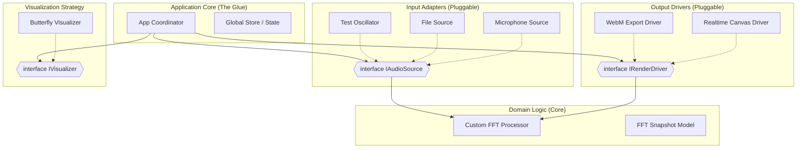

## システムアーキテクチャ概念図

「疎結合（Loose Coupling）」と「クリーンアーキテクチャ」の思想を取り入れ、各機能が**インターフェース（契約）**に基づいて対話します。




---

## モジュール定義とモデル詳細

**Dependency Injection (DI: 依存性の注入)** パターンと、各モジュールが自身のUI定義を持つ**Strategyパターン**を採用し、「疎結合（Loose Coupling）」と「クリーンアーキテクチャ」の思想を取り入れます。

### 1. Input Layer (音声入力ソース)

ここが最も疎結合にするべき部分です。アプリ本体は「現在どのソースが選ばれているか」だけを知り、その中身がマイクかファイルかは気にしません。

**Interface: `IAudioSource**`
すべての入力ソースはこのインターフェースを実装します。

* `initialize(audioContext): Promise<void>`
* `getNextBuffer(): Float32Array` (FFTエンジンに渡す生データ)
* `getMetaInfo(): { sampleRate, duration, ... }`
* `getUIComponent(): HTMLElement | null`
* **重要:** 各モジュール自身が必要なUI（ファイル選択ボタンなど）をDOM要素として返します。これをApp側でマウントします。ソースがロードされなければUIも表示されません。


**Models (Implementations):**

* **`MicrophoneSource`**: `getUserMedia` をラップ。UIは「Start/Stop」ボタンのみ。
* **`FileAudioSource`**: ファイルデコードと再生位置管理を担当。UIは「ファイル選択」「シークバー」。
* **`TestSignalSource`**: デバッグ用。正弦波などを生成。マイクが動かない時のテスト用モジュールとして機能します。

### 2. Domain Layer (FFT計算コア)

Web Audio APIの `AnalyserNode` は使わず、純粋な数値計算ロジックとして分離します。これにより、リアルタイム再生時でも動画書き出し時（オフライン）でも同じロジックを流用できます。

**Class: `FFTProcessor**`

* **Input:** `Float32Array` (時間領域データ)
* **Method:** `compute(buffer)`
* **Output:** `FFTSnapshot` (モデル)

**Model: `FFTSnapshot**`
可視化に必要なすべてのデータを含む不変（Immutable）オブジェクトです。

```typescript
interface FFTSnapshot {
  inputBuffer: Float32Array;      // 元の波形
  stages: ComplexArray[][];       // バタフライ演算の各段階 (2次元配列)
                                  // stages[0] = 入力, stages[logN] = 出力
  bitReversedIndices: number[];   // バタフライ演算特有の並び替えインデックス
}

```

### 3. Visualization Layer (描画ロジック)

p5.js への依存をここに閉じ込めます。

**Interface: `IVisualizer**`

* `setup(p5_instance, canvasWidth, canvasHeight)`
* `draw(p5_instance, snapshot: FFTSnapshot)`
* `updateConfig(config: ConfigObject)`

**Model: `ButterflyVisualizer**`
バタフライ図を描画する具体的な実装です。もし将来「波形表示だけ見たい」となったら、別のVisualizerクラスに差し替えるだけで済みます。

### 4. Driver Layer (駆動・出力モード)

「リアルタイム」と「動画書き出し」の違いを吸収するレイヤーです。

**Interface: `IRenderLoop**`

* `start()`
* `stop()`
* `onFrame((timestamp) => void)`

**Models (Implementations):**

* **`RealtimeLoop`**: `requestAnimationFrame` を使用してループを回します。システム時計に従って音声を再生させます。
* **`OfflineExportLoop`**: ループ内で時間を人工的に進めます（）。音声は鳴らさず、1フレームごとに描画→Canvasキャプチャ→WebMエンコーダーへプッシュ、を待ち合わせながら実行します。

### 5. Application Coordinator (Main)

これらをつなぐ接着剤です。

* **責務:**
* 利用可能な `IAudioSource` モジュールのリストを保持。
* ユーザーがコンボボックスでソースを切り替えたら、古いソースの `.disconnect()` と新しいソースの `.initialize()` を呼び出し、UIコンテナの中身を `.getUIComponent()` の結果に入れ替える。
* 「動画書き出し」ボタンが押されたら、Driverを `RealtimeLoop` から `OfflineExportLoop` に切り替える。


---

## 開発の進め方（提案）

このアーキテクチャに基づき、以下の順序で実装を行います。

1. **Step 1: Domain Core (FFT)**
* UIなし、音なし。数値配列を渡して、バタフライ演算の中間結果が正しくconsole.logに出るかだけをテストする純粋なJS/TSコードを作成。


2. **Step 2: Visualizer (p5.js)**
* Step 1のダミーデータを使って、バタフライ図が描画されるかを確認。


3. **Step 3: Realtime Driver & Test Source**
* マイクやファイルを使わず、「テスト信号（サイン波）」モジュールを作成し、リアルタイムで動くか確認。ここでモジュール切り替えの仕組みを作ります。


4. **Step 4: Real Inputs (Mic/File)**
* 実際にWeb Audio APIを繋ぎこみます。


5. **Step 5: WebM Exporter**
* 最後に動画書き出しドライバを実装します。
